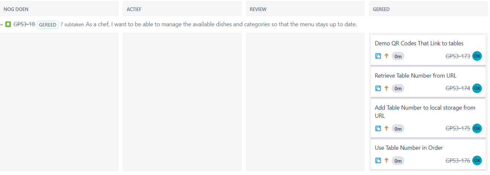

## Agile method
For this learning outcome you will need to analyse some agile working methods. Agile working methods are methods that are based on the agile working style. A few examples are:
* Scrum
* Kanban
* Extreme programming (XP)
* Lean
* Crystal
## Prove
To prove that I succeeded in this learning outcome, I have made a document explaining what Lean and Kanban are and how they differ from each other. You can find this document [here](../Group-project/Documents/Lean-and-kanban-research.pdf)

## Group project
I have also worked with a `Agile method` called Scrum in the group project. We have used `Jira` to make this work wel within our group. At first it didn't really go well because of our inexperience. But after a couple of sprints it really started to pay off. Because we started to log our hours and because everyone knew what to do after a while. For some clarification, this is our `Jira board`:

