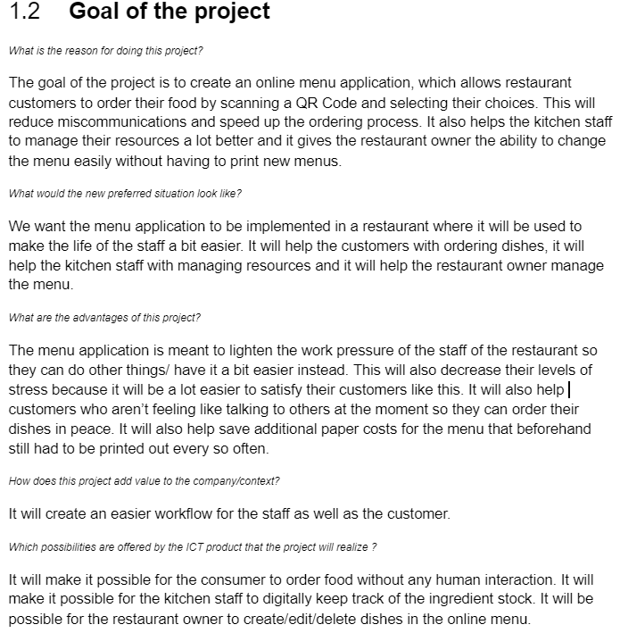
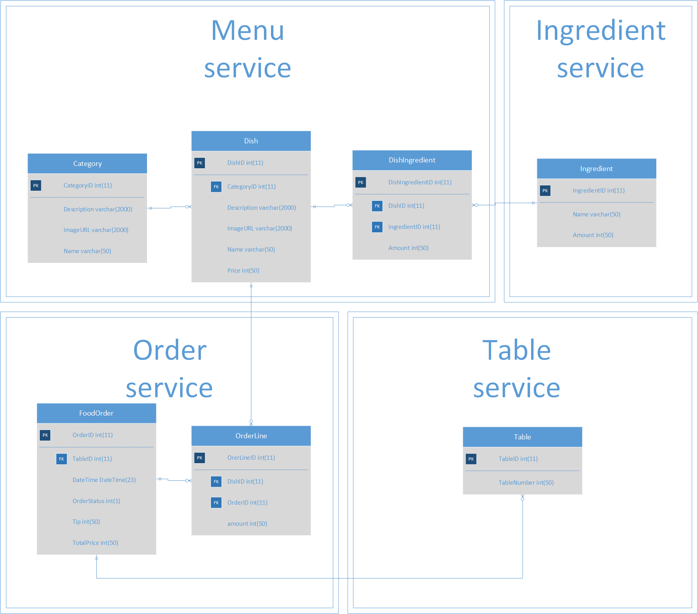

## Requirements and design
For this learning outcome I had to partake in the creation of a requirements document and a design diagram in my group project.
## Context
We are making a online menu application which will make it easier for the custommer to order food and easier for the kitchen staff to manage their resources.
## Prove
You can find the requirements I made for the group project:

You can find the diagram I made for the group project 

