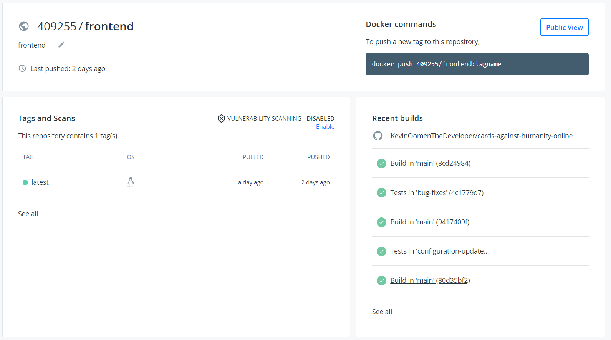
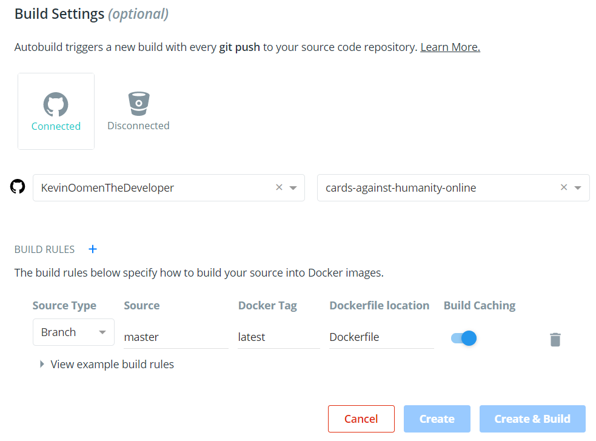

## CI/CD
### What is it?
`CI/CD` is the process of automated testing. `CI` stands for `Continuous Integration`. It is the process of testing your application before it will get pushed to your `version control`. It makes sure that the code quality of the application stays how it should be. Because you wouldn't want bugs in your repository. `CD` stand for `Continuous Delivery/Deployment`. It's the process of deploying or delivering the application. For example: The application gets a new push to master, everything works as intended, now the repository will be made into a `docker image` and send to `docker hub` for example. So a working version of the application now stand in `docker hub` ready to be used.
### Personal development
I learned how to implement `CI` through the group project because we put a some time into that subject. First off I started my projects in `Gitlab` but after sometime I switched to `Github` because the `CD` configuration was a lot easier over there. This did leave me with a Gitlab-CI file which i made for nothing because `Github` use `Github actions` to handle the `CI`. So I had to create a new `CI` configuration for my project and after that, I was all set to implement `CD` into the projects. I did this by going on `docker hub` and linking my `Github` account with `docker hub`. This gave me the possibility to select a repository and automatically make it so that if there are changes in the master that a new `docker image` of the project would be submitted onto `docker hub`. For documentation purposes my gitlab-ci.yml looked like this:
```yml
image: node:15.11.0
build-job:
  stage: build
  script:
    - echo "Hello, $GITLAB_USER_LOGIN!"
npm-test:
  stage: test
  script:
    - echo "Install npm..."
    - npm install
    - echo "Run npm test..."
    - npm test
deploy-prod:
  stage: deploy
  script:
    - echo "This job deploys something from the $CI_COMMIT_BRANCH branch."
```
First of it installed all the dependencies and after that was the it would run the tests. It also had a deployment section but this didn't do anything yet.
### Examples
In this example I will show you how I implemented `CI/CD` onto my `React` front-end. First of we start in the repository. Here I will need to create a new `Github action` for my `CI` configuration. This is going to be `workflow` called node.js.yml which will look like this:
```yml
# This workflow will do a clean install of node dependencies, build the source code and run tests across different versions of node
# For more information see: https://help.github.com/actions/language-and-framework-guides/using-nodejs-with-github-actions

name: Node.js CI
on:
  push:
    branches: [ main ]
  pull_request:
    branches: [ main ]
jobs:
  build:
    runs-on: ubuntu-latest
    strategy:
      matrix:
        node-version: [15.x]
        # See supported Node.js release schedule at https://nodejs.org/en/about/releases/
    steps:
    - uses: actions/checkout@v2
    - name: Use Node.js ${{ matrix.node-version }}
      uses: actions/setup-node@v2
      with:
        node-version: ${{ matrix.node-version }}
    - run: npm ci
    - run: npm run build --if-present
    - run: npm test
```
This code makes it so that everytime something gets pushed to the main branch or whenever there is a pull request on the main brach that the code will be tested with the `React` test method. First of, it will set the node version to "15". After that it will do the needed configuration to run the test and after that it will install all project dependencies, build the application and test it afterwards.

Now that we have added `CI` to the project it's time to look a bit deeper into `CD`. First of we will have to create a `Dockerfile` for the application that will look like this:
```dockerfile
FROM node:alpine as build-step
WORKDIR /app
COPY package*.json ./
RUN npm install
#from build directory to /app in container
COPY . .
RUN npm run build
from nginx
#copies build output from build-step to hosting folder in nginx
copy --from=build-step /app/build /usr/share/nginx/html
```
This `Dockerfile` is able to create a `Docker image` of of the application which will be the application running on nginx. You may ask: "Why would you want a `DockerFile` in here?". The `Dockerfile` is needed because i'm going to push a `Docker image` of of the application to `Docker hub`. This is where my CD comes in to play. I linked my Github account with Dockerhub so I can assign repositories on my account to be pushed onto Dockerhub automatically whenever something in the Main branch changes. My docker hub looks like this:



You can add repositories to `Docker hub` by doing this:



I have also made a `docker-compose` file which is able to start certain services all at once. It looks like this:
```yml
version: '3.5'
services:
  keycloak:
    container_name: keycloak
    image: jboss/keycloak:13.0.0
    restart: always
    volumes:
      - "./realm-export.json:/tmp/realm-export.json"
    ports:
      - "8080:8080"
    environment:
      KEYCLOAK_USER: ${KEYCLOAK_USER:-admin}
      KEYCLOAK_PASSWORD: ${KEYCLOAK_PASSWORD:-admin}
      DB_VENDOR: H2
      KEYCLOAK_IMPORT: /tmp/realm-export.json
      KEYCLOAK_FRONTEND_URL: http://localhost:8080/auth

    frontend:
      container_name: frontend
      image: 409255/frontend
      volumes:
        - "./nginx.conf:/etc/nginx/nginx.conf"
      ports:
        - "80:80"
      depends_on:
        - keycloak
        - backend

    backend:
      container_name: backend
      image: 409255/backend
      ports:
        - "9012:9012"
      env_file:
        - backend.env
      depends_on:
        - keycloak
        - chat-db

    chat-db:
      container_name: chat-db
      image: mysql
      command: --default-authentication-plugin=mysql_native_password
      restart: always
      environment:
        MYSQL_ROOT_PASSWORD: test

    adminer:
    container_name: adminer
    image: adminer
    restart: always
    ports:
      - 9090:8080
    depends_on:
      - chat-db
```
This docker compose file will start: `Keycloak`, `React frontend`, `Spring backend`, `Mysql database` and `Adminer`. These services are needed to run the entire application at once. The compose file will get the front-/back-end docker images from `Docker hub`. There are also some environment variables that are being given by the `.env` file. 
