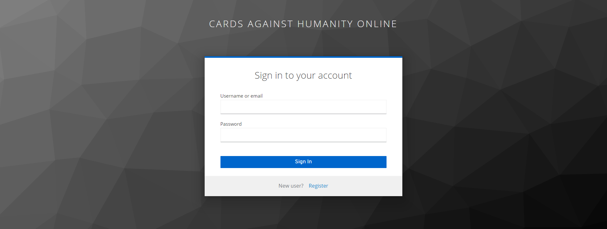
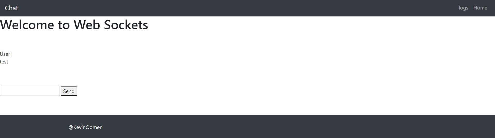
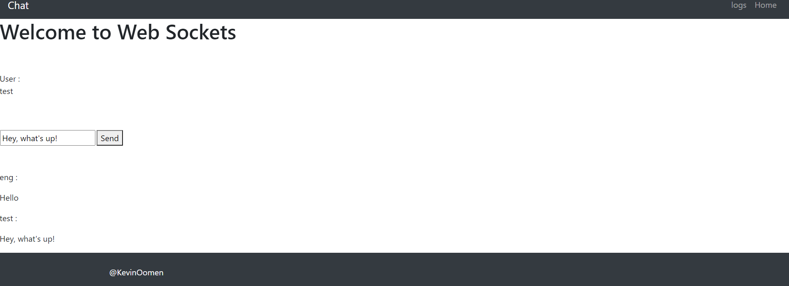
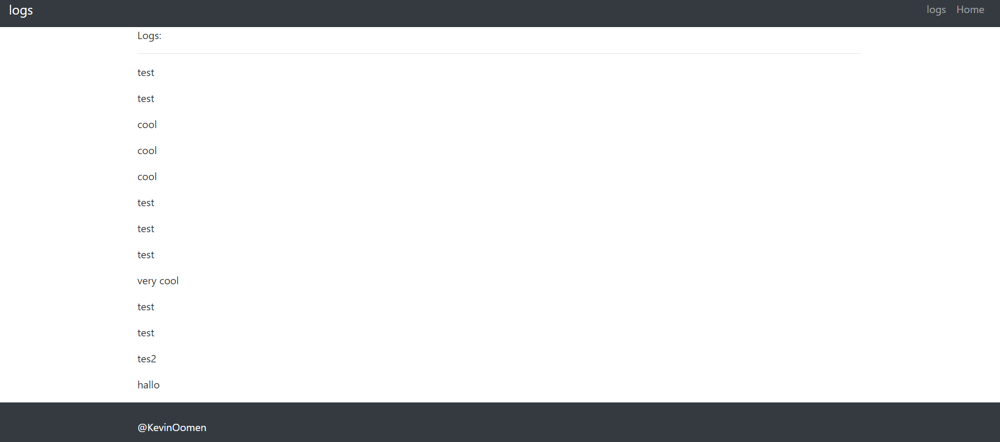

## Web application
In this document I will Show what I have done for the Web application learning outcome.

### Context
We had to create a `full-stack` web application for this learning outcome. A `full-stack` web application is a application that makes use of a front-/back-end. So I will have to create a application that has a front-end that communicates with a functioning backend.

### Personal development
In this project I have had a lot of personal development. I started working on this project by trying out new thing and research some frameworks. I have looked at: `Svelte`, `React`, `Spring`, `Quarkus` and `Dropwizard`. But in the end I choose for a `React` front-end and a `Spring` backend. I choose for these because we used them in the group project aswell and thath would mean that it would become easier to understand these frameworks because I would work on them in my individual project and in my group project. I did create a prove of concept for `Quarkus` which you can find here. Becasue of time management reasons I have had to take one part of my project and focus on that because i wouldn't have had enough time to create the entire application anymore. This was because of multitude of reasons. It took for example some time to understand `CI/CD` process and in first case i wanted to use `Quarkus` and `Svelte` as frameworks because I wanted to learn how these worked. But after sometime I chose to use `React` and `Spring` instead because these are very popular and have a large community behind them which will help with debuging bugs and implementing things I don't know yet. And because I was using these in my group project aswell. I chose to create the chat functionality of my application. I wanted to do this with `websockets` to integrate something I haven't used yet. I also implemented `Keycloak` into my project as a `identity provider`. I also use `keycloak user` id's to save the messsages that are being send to the backend and I created private routing in the front-end that is focused on the role of the user so you can't go to certain webpages inside of my application if you don't have the correct role. You can find these projects at the end of this document.
### Roadblocks and isues
I have encountered a lot of a roadblocks and issues aswell. For example: I tried to implement `websockets` into my chat application but this proved troublesome. Because the configuration was very hard to figure out because I hadn't worked with `websockets` yet. I had to integrate it in both my front-/back-end. So I had to know how to configure the websocktes in my backend and make sure that the calls where getting caught in the right way. And after I had correctly implemented it in my back-end I had to make sure that correct calls where send to the back-end and that my front-end configuration was right aswell. I did get a lot of problems with `CORS` and that also took me a long way to figure out how I had could make that work.
### Applications
#### React front-end ("Cards against humanity online")
This is the project I used for my front-end. You will be able to find it [here](https://github.com/KevinOomenTheDeveloper/cards-against-humanity-online)

#### Spring back-end ("Chat service")
This is the project I used for my back-end. You will be anle to find it [here](https://github.com/KevinOomenTheDeveloper/chat-service)

### Application screenshots
#### Login

#### Register

#### Chat

#### Logs

